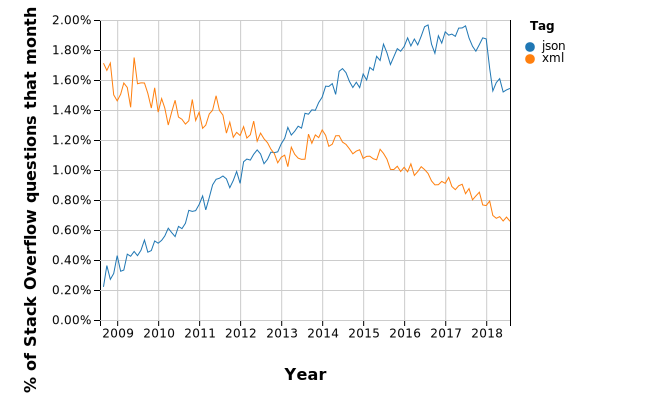

```{r message=FALSE, warning=FALSE, include=FALSE, paged.print=FALSE}
library(tidyverse)
library(knitr)
library(purrr)
library(XML)
library(jsonlite)
```


## Waarom NoSQL?
Als u met Excel werkt of uw data bewaard in MySQL bent u gewend om data op te slaan in rijen en kolommen. Bijvoorbeeld als u klantgegevens opslaat:

```{r results='asis'}
voorVec <- c("Witold", "Caroline")
achterVec <- c("ten Hove", "Tensen")
naamDF <- data.frame(Voornaam = voorVec, Achternaam = achterVec, stringsAsFactors = FALSE)
naamDF
kable(naamDF, caption = "Een data-tabel")
```

Iedere regel is een klant, iedere kolom een variabele en in iedere cel staat één waarde. Stel echter dat u alle telefoonnumers van uw klanten wilt opslaan en dat sommige klanten meerdere telefoonnummers hebben. Een mogelijkheid is dan om in één cel alle telefoonnummers op te slaan:


```{r results='asis'}
voorVec <- c("Witek", "Caroline")
achterVec <- c("ten Hove", "Tensen")
telVec <- c("06111111; 06222222", "06333333")
naamDF <- data.frame(Voornaam = voorVec, Achternaam = achterVec, Telefooonummer = telVec, stringsAsFactors = FALSE)
kable(naamDF, caption = "Een data-tabel met meerdere waarden in één cel")
```

Dit kan echter een probleem gaan veroorzaken bij het exporteren of doorzoeken van de data. Zodra uw data asymmetrisch dreigt te worden, is het verstandiger om een NoSQL formaat te overwegen. De belangrijkste formaten qua populariteit zijn XML en JSON.

## XML
Door data te annoteren kan aan afzonderlijke data-elementen betekenis worden toegevoegd. Een data-formaat dat hier gebruik van maakt is Extensible Markup Language (XML). Zo kan per klant aan de data die betrekking heeft op de voornaam een tag <voornaam> worden toegevoegd en ieder telefoonnummer apart als zodanig worden gekenmerkt. 

```{r}
data<- naamDF

xml <- xmlTree()
# names(xml)

xml$addTag("klanten", close=FALSE)
for (i in 1:nrow(data)) {
    xml$addTag("klant", close=FALSE)
    for (j in names(data)) {
      celldata <- unlist(strsplit(data[i, j], "[;]"))
       for (k in celldata){
          xml$addTag(j, trimws(k))
       }
       
    }
    xml$closeTag()
}
xml$closeTag()
cat(saveXML(xml, prefix = ''))
```

Via deze methode kan makkelijk data worden toegevoegd, bijvoorbeeld een tweede voornaam:

```{r}
data[1,1] <- "Witold; Frederik"
data[2,1] <- "Caroline; Egbertine"

xml <- xmlTree()
# names(xml)

xml$addTag("klanten", close=FALSE)
for (i in 1:nrow(data)) {
    xml$addTag("klant", close=FALSE)
    for (j in names(data)) {
      celldata <- unlist(strsplit(data[i, j], "[;]"))
       for (k in celldata){
          xml$addTag(j, trimws(k))
       }
       
    }
    xml$closeTag()
}
xml$closeTag()
cat(saveXML(xml, prefix = ''))
```


## JSON

Tot voor kort was XML de standaardmethode om data vast te leggen in een webomgeving. Echter momenteel wordt deze functie steeds meer overgenomen door Javascript Object Notation (JSON).



De belangrijkste is de opkomst van zogenaanmde Application Programming Interfaces (APIs). Veel online aanbieders van diensten bieden derden de gelegenheid om toegang te krijgen tot hun data. Zo kan heel makkelijk in één webapplicatie data worden vewerkt van bijvoorbeeld Twitter, een weerdienst en CNN.

JSON werkt met zogenaamde key:value sets:

```{r}
voorList <- list(c("Witold"), c("Caroline"))
achterList <- list(c("ten Hove"), c("Tefsen"))
telList <- list(c("06111111"), c("06333333"))
klantDF <- tibble(Voornaam = voorList, Achternaam = achterList, Telefoon = telList)
klantJSON = toJSON(klantDF, pretty = TRUE, auto_unbox = TRUE)
klantJSON
```

Als een waarde (value) uit meerdere elementen bestaat, worden ze in een zogenaamde arrays opgeslagen.

```{r}
voorList <- list(c("Witold", "Frederik"), c("Caroline", "Egbertine"))
achterList <- list(c("ten Hove"), c("Tefsen"))
telList <- list(c("06111111", 06222222), c("06333333"))
klantDF <- tibble(Voornaam = voorList, Achternaam = achterList, Telefoon = telList)
klantJSON = toJSON(klantDF, pretty = TRUE, auto_unbox = TRUE)
klantJSON
```

De arrays zijn geindexeerd en zo kan ieder element makkelijk worden opgehaald.

## Van XML >> JSON

## JSON opslaan in MongoDB
