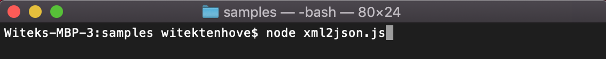
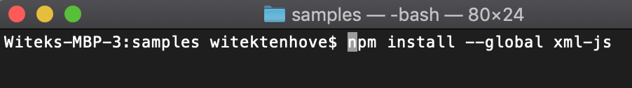

```{r message=FALSE, warning=FALSE, include=FALSE, paged.print=FALSE}
library(tidyverse)
library(knitr)
library(purrr)
library(XML)
library(jsonlite)
```
<em>
De datarevolutie wordt niet alleen bepaald door de hoeveelheid data die wordt gegenereerd, maar ook door innovatieve systemen om data op te slaan. Traditionele structuren waar data in tabellen wordt opgeslagen, worden nog steeds gebruikt en hebben hun toepassing. Applicaties die voor web en mobiel worden ontwikkeld, hebben echter een structuur nodig die het wegschrijven en opzoeken van data eenvoudiger en sneller maakt.
</em>

In dit artikel bespreek ik wanneer het beste voor asymmetrische datastructuren (NoSQL) gekozen kan worden. Daarna beschrijf ik de twee meest voorkomende standaarden: XML en JSON. Het artikel eindigt met een illustratie van een workflow waarbij XML data wordt omgezet naar JSON.

## NoSQL
Als u met Excel werkt of uw data bewaart in MySQL bent u gewend om data op te slaan in rijen en kolommen. Bijvoorbeeld als u klantgegevens opslaat:

```{r results='asis'}
voorVec <- c("Witold", "Caroline")
achterVec <- c("ten Hove", "Tensen")
naamDF <- data.frame(Voornaam = voorVec, Achternaam = achterVec, stringsAsFactors = FALSE)
kable(naamDF, caption = "Een data-tabel")
```

Iedere regel is een klant, iedere kolom een variabele en in iedere cel staat één waarde.

Stel echter dat u alle telefoonnumers van uw klanten wilt opslaan en dat sommige klanten meerdere telefoonnummers hebben. Een mogelijkheid is dan om in één cel alle telefoonnummers op te slaan:


```{r results='asis'}
voorVec <- c("Witek", "Caroline")
achterVec <- c("ten Hove", "Tensen")
telVec <- c("06111111; 06222222", "06333333")
naamDF <- data.frame(Voornaam = voorVec, Achternaam = achterVec, Telefoon = telVec, stringsAsFactors = FALSE)
kable(naamDF, caption = "Een data-tabel met meerdere waarden in één cel")
```

Dit kan echter een probleem gaan veroorzaken bij het exporteren of doorzoeken van de data. Zodra uw data asymmetrisch dreigt te worden, is het verstandiger om een NoSQL formaat te overwegen. De belangrijkste formaten qua populariteit zijn XML en JSON.

## XML
Door data te annoteren kan aan afzonderlijke data-elementen betekenis worden toegevoegd. Een data-formaat dat hier gebruik van maakt, is Extensible Markup Language (XML). Zo kan in ons voorbeeld aan de data die betrekking heeft op de voornaam een tag <voornaam> worden toegevoegd en ieder telefoonnummer apart als zodanig worden gekenmerkt. 

```{r}
data<- naamDF

xml <- xmlTree()
# names(xml)

xml$addTag("klanten", close=FALSE)
for (i in 1:nrow(data)) {
    xml$addTag("klant", close=FALSE)
    for (j in names(data)) {
      celldata <- unlist(strsplit(data[i, j], "[;]"))
       for (k in celldata){
          xml$addTag(j, trimws(k))
       }
       
    }
    xml$closeTag()
}
xml$closeTag()
cat(saveXML(xml, prefix = ''))
```

Via deze methode kan makkelijk data worden toegevoegd, bijvoorbeeld een tweede voornaam:

```{r echo=FALSE, message=FALSE, warning=FALSE, paged.print=FALSE}
data[1,1] <- "Witold; Frederik"
data[2,1] <- "Caroline; Egbertine"

xml <- xmlTree()
# names(xml)

xml$addTag("klanten", close=FALSE)
for (i in 1:nrow(data)) {
    xml$addTag("klant", close=FALSE)
    for (j in names(data)) {
      celldata <- unlist(strsplit(data[i, j], "[;]"))
       for (k in celldata){
          xml$addTag(j, trimws(k))
       }
       
    }
    xml$closeTag()
}
xml$closeTag()
cat(saveXML(xml, prefix = ''))
```

## JSON

Tot voor kort was XML de standaardmethode om data vast te leggen in een webomgeving. Echter inmiddels is deze functie overgenomen door Javascript Object Notation (JSON).

<figure>
    
    <figcaption>Bron: <a href="https://insights.stackoverflow.com/trends?tags=json%2Cxml" target="_blank">Stack Overflow</a></figcaption>
</figure>

De belangrijkste reden hiervoor is de opkomst van zogenaamde Application Programming Interfaces (APIs). Veel online aanbieders van diensten bieden de gelegenheid om toegang te krijgen tot hun data. De data wordt meestal als JSON verstuurd. Aangezien moderne webapplicaties al in Javascript zijn geschreven kan JSON zonder verdere bewerking gebruikt worden. Zo kan heel makkelijk in één webapplicatie data worden gecombineerd: bijvoorbeeld tweets van [Twitter](https://developer.twitter.com/en/products/products-overview) gecombineerd met [weersvoorspellingen](https://openweathermap.org/api) en het nieuws via [CNN](http://developer.cnn.com/).

JSON werkt met zogenaamde key: value sets:

```{r echo=FALSE, message=FALSE, warning=FALSE, paged.print=FALSE}
voorList <- list(c("Witold"), c("Caroline"))
achterList <- list(c("ten Hove"), c("Tefsen"))
telList <- list(c("06111111"), c("06333333"))
klantDF <- tibble(Voornaam = voorList, Achternaam = achterList, Telefoon = telList)
klantJSON = toJSON(klantDF, pretty = TRUE, auto_unbox = TRUE)
klantJSON
```


Als een waarde (value) uit meerdere elementen bestaat, worden ze in een reeksen (arrays) opgeslagen.

```{r}
voorList <- list(c("Witold", "Frederik"), c("Caroline", "Egbertine"))
achterList <- list(c("ten Hove"), c("Tefsen"))
telList <- list(c("06111111", 06222222), c("06333333"))
klantDF <- tibble(Voornaam = voorList, Achternaam = achterList, Telefoon = telList)
klantJSON = toJSON(klantDF, pretty = TRUE, auto_unbox = TRUE)
klantJSON
```

De reeksen zijn geindexeerd en zo kan ieder element makkelijk worden opgehaald.

## Casus: Van XML naar JSON naar MongoDB

In deze casus beschrijven we een organisatie die voor haar webdiensten gebruikt maakt van publieke data. Deze data wordt als XML aangeboden op websites van verschillende overheden. De organisatie wil deze data doorzoekbaar maken voor haar klanten en als API ter beschikking stellen. De workflow betaat uit drie stappen:

1. De XML-data moet worden omgezet naar JSON
2. De JSON-data moet worden ingelezen in een NoSQL database
3. De data uit de database kan via een API worden geraadpleegd

De volgende Javascript code toont hoe de eerste stap via [Node.js](https://nodejs.org/en/) (server side) kan worden uitgevoerd. De overige stappen zullen in een volgend artikel worden toegelicht.

### XML naar JSON

We gaan uit van het volgende XML-bestand. Dit is een fragment van een bestaand document dat door de overheid online beschikbaar wordt gesteld als open data.

<figure>
  <figcaption>kavels.xml</figcaption>
```xml
    <?xml version="1.0" encoding="utf-8"?>
    
    <kavels>
          <kavel>
              <nummer>1800</nummer>
              <omschrijving>Kavel 1800</omschrijving>
              <goederengroep>Voertuigen en onderdelen</goederengroep>
              <verkooptekst>
                  <verkooptekstregel>1800</verkooptekstregel>
                  <verkooptekstregel>Motorfiets</verkooptekstregel>
                  <verkooptekstregel>PIAGGIO</verkooptekstregel>
                  <verkooptekstregel>Type mp3 500 lt</verkooptekstregel>
                  <verkooptekstregel>Kenteken 9-XHR-38</verkooptekstregel>
                  <verkooptekstregel>Afgelezen km-stand 1.802</verkooptekstregel>
                  <verkooptekstregel>Datum eerste toelating 07.08.2014</verkooptekstregel>
               </verkooptekst>
          </kavel>
          <kavel>
              <nummer>1801</nummer>
              <omschrijving>Kavel 1801</omschrijving>
              <goederengroep>(Brom)fietsen en scooters</goederengroep>
              <verkooptekst>
                  <verkooptekstregel>1801</verkooptekstregel>
                  <verkooptekstregel>Bromfiets</verkooptekstregel>
                  <verkooptekstregel>PEUGEOT</verkooptekstregel>
                  <verkooptekstregel>Type vivacity</verkooptekstregel>
                  <verkooptekstregel>Kenteken F-917-FR</verkooptekstregel>
                  <verkooptekstregel>Afgelezen km-stand 7.706</verkooptekstregel>
                  <verkooptekstregel>Datum eerste toelating 29.03.2012</verkooptekstregel>
              </verkooptekst>
          </kavel>
    </kavels>
```
</figure>

We willen dit bestand regelmatig downloaden en in een eigen database verwerken. Deze database kan daarna door een app worden benaderd via een API. Dit kan een eigen app zijn of een applicatie die door derden is ontwikkeld.

Voor de eerste stap, van XML naar JSON, bouwen we een script in Javascript dat op een server wordt uitgevoerd. In dit voorbeeld heeft het script de naam: `xml2json.js`.

Om een JS-script uit te voeren dient u Node.js op uw eigen pc of server te installeren. Daarna kunt u het script runnen door in de folder waar het script wordt bewaard het commando ` node <scriptnaam> ` uit te voeren (in de shell).

figure>
    
    <figcaption>Shell commando met node</figcaption>
</figure>
<br>

Door Node.js te gebruiken, krijgen we toegang tot een enorme bibliotheek van handige functies. Deze functies zijn verzameld in zogenaamde packages. In dit geval gebruiken we de package `xml-js`. De package kan geïnstalleerd worden via het commando `npm install xml-js`. NPM - Node Package Manager is onderdeel van de Node.js installatie.

figure>
    
    <figcaption>Shell commando met node</figcaption>
</figure>
<br>

Nu hebben we alle onderdelen om het script te bouwen. De afzonderlijke stappen zijn worden in de comments beschreven.

<figure>
  <figcaption>xml2json.js</figcaption>

<pre class="prettyprint">
    // Laad de benodigde packages
    var fs = require('fs');
    var convert = require('xml-js');
    
    // Lees de XML-data in
    var xml = require('fs').readFileSync('kavels.xml', 'utf8');
    
    // Transformeer data naar JSON
    var options = {
                    compact: true,
                    ignoreAtrributes: true,
                    ignoreDeclaration: true
                  };
    var result = convert.xml2js(xml, options);
    var kavels = JSON.stringify(result, null, 2);
    console.log(JSON.stringify(result, null, 2)); // Controle
    
    // Schrijf de data weg in een JSON-bestand
    fs.writeFile('kavels.json', kavels, 'utf8', function(err){
            if(err){
                  console.log(err);
            } else {
                  console.log('Everything went OK!');
            }
    });

</pre>
</figure>

Het script genereert in de eigen folder een nieuw bestand met de json data.

<figure>
  <figcaption>kavels.json</figcaption>
```json
    {
      "kavels": {
        "kavel": [
          {
            "nummer": {
              "_text": "1800"
            },
            "omschrijving": {
              "_text": "Kavel 1800"
            },
            "goederengroep": {
              "_text": "Voertuigen en onderdelen"
            },
            "verkooptekst": {
              "verkooptekstregel": [
                {
                  "_text": "1800"
                },
                {
                  "_text": "Motorfiets"
                },
                {
                  "_text": "PIAGGIO"
                },
                {
                  "_text": "Type mp3 500 lt"
                },
                {
                  "_text": "Kenteken 9-XHR-38"
                },
                {
                  "_text": "Afgelezen km-stand 1.802"
                },
                {
                  "_text": "Datum eerste toelating 07.08.2014"
                }
              ]
            }
          },
          {
            "nummer": {
              "_text": "1801"
            },
            "omschrijving": {
              "_text": "Kavel 1801"
            },
            "goederengroep": {
              "_text": "(Brom)fietsen en scooters"
            },
            "verkooptekst": {
              "verkooptekstregel": [
                {
                  "_text": "1801"
                },
                {
                  "_text": "Bromfiets"
                },
                {
                  "_text": "PEUGEOT"
                },
                {
                  "_text": "Type vivacity"
                },
                {
                  "_text": "Kenteken F-917-FR"
                },
                {
                  "_text": "Afgelezen km-stand 7.706"
                },
                {
                  "_text": "Datum eerste toelating 29.03.2012"
                }
              ]
            }
          }
        ]
      }
    }
```
</figure>

JSON data kan direct worden ingelezen in de meest gangbare NoSQL databases. In een volgend artikel beschrijf ik de workflow voor MongoDB en Google Firebase.
