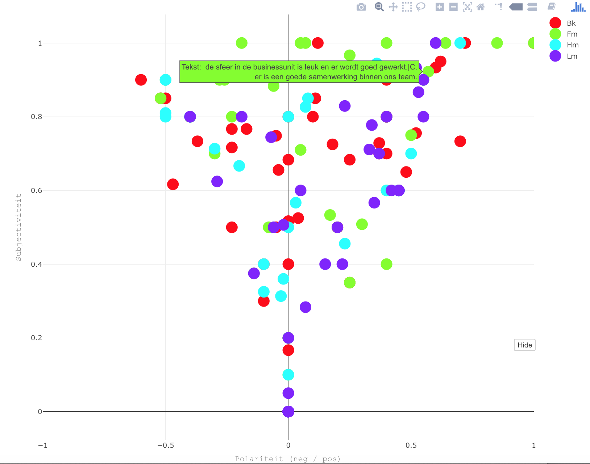

```{r setup, include=FALSE}
knitr::opts_chunk$set(echo = FALSE)
```

<em>
Systemen om tekst begrijpend te lezen en te verwerken tot data hebben zich de laatste tijd enorm ontwikkeld. De belangrijkste oorzaken zijn doorbraken op het gebied van kunstmatige intelligentie (deep learning) en de democratisering van kennis via open source systemen.
</em>

<figure>
    
    <figcaption>Bron: eigen werk</figcaption>
</figure>
