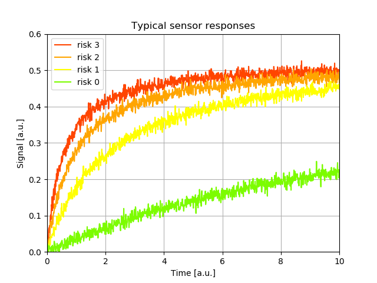
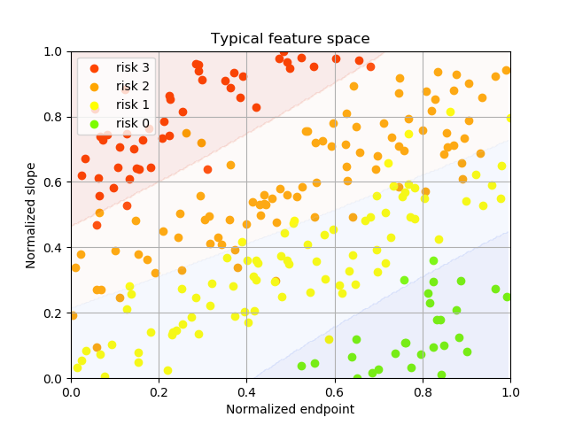
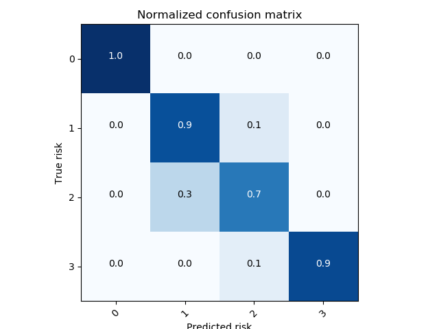

_Op dit moment wordt er meer data verzameld dan ooit te voren. Maar wat doen we vervolgens met al deze gegevens? Soms lijkt het erop dat grote datasets eerder een troebel dan een duidelijk beeld van de praktijk geven. Toch kan, door het zoeken naar structuren in gegevens, belangrijke informatie worden gewonnen op basis waarvan je betere beslissingen kan nemen. In dit artikel laat ik je middels een toepassing zien hoe je, met software die voor iedereen toegankelijk is, informatie kan winnen uit gestructureerde data._

We gaan in dit voorbeeld uit van een complexe chemische sensor die de aanwezigheid van een gevaarlijke stof kan detecteren.
De responsie van de sensor op een bepaalde concentratie van deze stof is alles behalve lineair. 
Sterker nog, als de concentratie groter wordt, dan is het niet altijd zo dat de sensorresponsie ook groter wordt!
Daarnaast is de precisie van de sensor niet geweldig, want er is veel ruis op het sensorsignaal aanwezig.
Dit betekent dat je niet zomaar kan zeggen of er een gevaarlijke concentratie aanwezig is als de sensor respons hoog of laag is.
Terecht vraag je je misschien af waarom we geen andere sensor hebben gekozen? 
In dit geval is er geen ander mogelijkheid: alleen deze sensor kan de gevaarlijke stof meten.

Wat nu? Het blijkt dat als we naar de dynamiek van het meetsignaal kijken door meer gegevens te verzamelen, we toch risicoklassen kunnen aangeven met behulp van deze sensor.
In onderstaande grafiek zijn voorbeelden van sensorresponsies afgebeeld in het geval van vier verschillende riscioniveau's: weinig(0), matig(1), hevig(2), ernstig(3).
We kunnen deze data parameteriseren door bepaalde kenmerken bv. alleen de helling en de eindwaarde van een signaal te berekenen, zo wordt de dataset behoorlijk gecomprimeerd.
Op basis van de gekozen kenmerken (zgn. features) kunnnen we een algoritme ontwerpen dat probeert in te schatten welk riscioniveau aanwezig is.
Omdat de risicoklasse willen bepalen gebruiken we dus een Classifier algoritme.

Een handige manier om het algoritme in te leren is door gebruik te maken van voorbeelden (Supervised Learning).
In dit geval hebben we tientallen metingen beschikbaar waarvan bekend is wat het veiligheidsniveau was toen de data werd opgenomen.
Deze dataset verdelen we nu in twee stukken. Het ene deel (80%) gaan we gebruiken om de classifier te trainen en het andere deel (20%) om resultaat van de training te testen. 
We willen immers weten hoe gaat het algoritme zou kunnen werken!

Nu aan de slag! In dit voorbeeld gebruiken we de populaire programmeertaal Python samen met de Open-source toolbox scikit-learn.
Allereerst verdelen we de data (f) en labels (y) in 2 sets, waarbij het van belang is dat er genoeg voorbeelden van alle klassen in beide sets aanwezig zijn.
Scikit-learn heeft voor dat doel de handige functie StratifiedShuffleSplit.

<pre class="prettyprint">
  sss = sklearn.model_selection.StratifiedShuffleSplit(n_splits=1, test_size=0.2)
  for train_index, test_index in sss.split(f,y):
      f_train, f_test = f[train_index], f[test_index]
      y_train, y_test = y[train_index], y[test_index]
</pre>

Nu kiezen we een classifier, in dit geval op basis van een Support Vector Machine:

<pre class="prettyprint">
  clf = sklearn.svm.SVC(kernel="poly", degree=3, coef0=1, C=1.0)
</pre>

De verschillende parameters van deze functie laat ik in dit artikel buiten beschouwing.
Vervolgens trainen we de classifier:

<pre class="prettyprint">
  clf.fit(f_train, y_train)
</pre>

Laten we eens proberen te visualiseren wat hier is gebeurd.
In het volgende plaatje zijn voorbeelden van combinaties van kenmerken weergegeven voor de verschillende risiconiveau's. 
Je kunt je elke stip dus voorstellen als de compacte representatie van een sensorresponsie uit de vorige grafiek.
Door de classifier deze voorbeelden te laten zien, kan de classifier gebieden in de kenmerkenruimte (featurespace) aangeven die overeenkomen met een riscioniveau.

Nu willen we graag weten hoe goed de classifier zijn werk doet. 
Daarvoor gebruiken we de 20% van de data die we eerder apart gezet hebben, en proberen de bijbehorende risicoklasse te voorspellen.

<pre class="prettyprint">
  y_pred = clf.predict(f_test)
</pre>

Omdat we al wisten wat het risiconiveau was toen deze metingen werden gedaan, kunnen we de voorspelde en werkelijke risiconiveau's met elkaar vergelijken.
Dat geeft een aardig beeld van de kwaliteit van de methode. 
Onderstaande matrix laat welke fractie van het werkelijk niveau goed werd ingeschat, en dat voor elk niveau.

Scikit-learn heeft een handige functie om direct een rapportje te genereren dat iets vertelt over de classifier.

<pre class="prettyprint">
  print(sklearn.metrics.classification_report(y_test,y_pred))
</pre>

Resultaat: 

<pre class="prettyprint">
               precision    recall  f1-score   support
  
          0.0       1.00      1.00      1.00         5
          1.0       0.88      0.83      0.86        18
          2.0       0.83      0.79      0.81        19
          3.0       0.82      1.00      0.90         9
  
  avg / total       0.86      0.86      0.86        51
</pre>

We kijken nu even naar de precisie en recall. Precisie geeft aan welk percentage van de voorspelde risiconiveau's daadwerkelijk juist is. Recall geeft aan welk percentage van de voorbeelden in een bepaald risiconiveau door de classifier wordt gevonden.
Het is belangrijk dat ernstige risico's niet worden gemist, en in dit voorbeeld is de recall voor klasse 3 100%, en dus voldoen we aan deze voorwaarde.

Maar let op! De dataset is op dit moment vrij klein, ga dus altijd verstandig om met zo'n resultaat. Misschien is het te mooi om waar te zijn!

