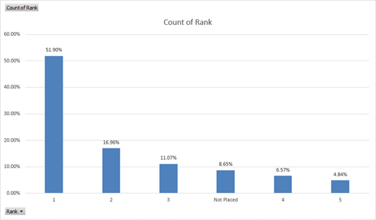

*International Relations FEM (IR FEM) is de afdeling internationalisering van de Faculteit Economie en Management (FEM). IR FEM heeft expertise over internationalisering van het hoger onderwijs en overzicht over de internationaliseringsactiviteiten en de internationale contacten van de faculteit. Het IR FEM promoot en faciliteert alle activiteiten rondom studentenmobiliteit met de internationale partnerinstellingen van de FEM om studenten van opleidingen de mogelijkheid te bieden een semester in het buitenland te verblijven (mobility window).*

Study Abroad is een goede manier om culturele verrijking op te doen en kennis te maken met verschillende methoden van lesgeven. Elk jaar melden honderden studenten zich aan om op Study Abroad te gaan. Dit aantal neemt alleen maar toe.

Studenten melden zich aan door een lijst van voorkeuren op te geven van waar ze naar toe willen. In de vorige Study Abroad cyclus werden al deze studenten met de hand geplaatst aan de hand van een gesprek. Naast het gegeven dat dit een behoorlijk tijdrovende investering is, is het achteraf moeilijk herleidbaar op welke gronden studenten al dan niet de plek gekregen hebben. Het proces was daardoor onvoldoende transparant. Zo was achteraf niet te controleren of wellicht een andere student beter had gepast op een bepaalde plek. Daarom is gezocht naar een oplossing voor de matching.

In de wiskunde is een soortgelijk probleem al lang bekend. De klasse van matching problemen is een veld waarbij markt design en speltheorie bij elkaar komen. In het stable marriage problem (een subset van de klasse van matching problemen) willen we een even grote set mannen ( M ) matchen aan een set vrouwen ( V ). Dit resultaat moet stabiel zijn, wat betekent dat er aan twee condities voldaan moet worden:

1. Er mag niet een element n zijn uit M dat liever aan een ander element k uit V gematcht wilt zijn dan zijn huidige match
2. Tegelijkertijd mag er ook niet element k uit V ook liever gematcht zijn aan element n uit M

Als er wel een paar bestaat dat liever aan elkaar gematcht wilt worden dan hun huidige matches dan is het resultaat onstabiel en moet er opnieuw gekeken worden naar de matching.

We kunnen een parallel  trekken naar studenten en scholen als we inzien dat de set mannen overeen komt met de set studenten en de set vrouwen overeen komt met de set van universiteiten. We willen dus een methode vinden waarbij we studenten kunnen matchen aan universiteiten die eerlijk is en zoveel mogelijk studenten plaatst op hun voorkeursplek maar in plaats van dat elke universiteit maar een student kan aannemen kan elke universiteit meerdere studenten aannemen (many-to-one matching in plaats van one-to-one matching).

In 1962 verscheen er een publicatie van David Gale & Lloyd Shapley dat er altijd een stabiele oplossing bestaat. Het algoritme dat zo'n oplossing vindt wordt het Gale-Shapley algoritme (ookwel Deferred Acceptance) genoemd. Dit algoritme matcht een set elementen aan een andere set elementen op basis van een voorkeurslijst. 
Het algoritme werkt in onze situatie als volgt; we een set van studenten S hebben en een set van universiteiten R die we aan elkaar matchen:

  1. Alle studenten en universiteiten zijn unmatched
  2. Neem een unmatched student, s , en ga naar 3. Als er niet zo'n student bestaat, stop.
  3. Als de voorkeurslijst van s leeg is, overweeg deze student niet verder en ga naar 1. Anders neem zijn meest gewilde universiteit, r , en ga naar 4.
  4. Als s niet in de voorkeurslijst van r voorkomt, haal r weg van de voorkeurslijst van s en ga naar 2. Anders als r nog plek heeft match s aan r en ga naar 1. Zoniet ga naar 5.
  5. Overweeg de voorlopige matching van r en hun minst gewilde student s ' die nu gematcht is. Als r liever s wilt hebben dan s ' dan unmatchen we s ' en matchen we s aan r . Zoniet dan halen we s weg van de voorkeurslijst van r en r van de voorkeurslijst van s en gaan we naar 2.

Het gevolg van bovenstaande procedure voor de plaatsing van studenten voor study abroad is dat we eerst voorlopig elke student plaatsen bij zijn hoogst mogelijke voorkeur totdat we de lijst helemaal door zijn. Daarna gaan we kijken naar alle vrije studenten en plaatsen we die op hun tweede voorkeur. Mocht het hier voorkomen dat zij liever gewild zijn door een universiteit die al vol zit dan wordt de minst gewilde student weggehaald van zijn plaatsing en wordt deze nieuwe student daar geplaatst. We gaan dan door met het matchen van studenten op hun derde voorkeur waarbij we weer de meer gewilde student plaatsen bij een universiteit. Dit gaat door totdat de lijst van voorkeuren leeg is waarna elke match definitief wordt.

Het kan dus voorkomen dat er studenten overblijven die niet gematcht kunnen worden aan een van de universiteiten die ze hadden gekozen omdat ze allemaal vol zaten met studenten die meer gewild waren dan zijzelf. Dit is een natuurlijk gevolg omdat studenten niet elke universiteit op hun voorkeurslijst zetten. De voorkeurslijsten zijn dus incompleet. De matching die hier uit komt is altijd stabiel, er is dus niet een student s die geplaatst is bij universiteit r maar liever universiteit r' heeft en er is niet een universiteit r' die gematcht is met student s' maar liever student s heeft.

Het algoritme is ook fair & strategy proof. Dit houdt in dat de beste strategie die een student kan volgen, is om zijn ware voorkeuren op te geven en dus niet een betere plaatsing kan krijgen door te liegen op zijn voorkeurslijst. Het is ook een eerlijke methode omdat er geen student s die geplaatst is bij universiteit r een andere universiteit r' liever heeft waar s ook een hogere prioriteit heeft dan alle andere geplaatste studenten bij r'.

We hebben dus zo een stabiele, eerlijke methode gevonden om studenten te matchen aan universiteiten voor Study Abroad. Het gebruikte algoritme is transparanter voor de studenten en maakt minder fouten (er bestaat immers altijd een stabiele oplossing). 
In onderstaande grafiek is te zien het % studenten die op een bepaalde voorkeur zijn geplaatst.

